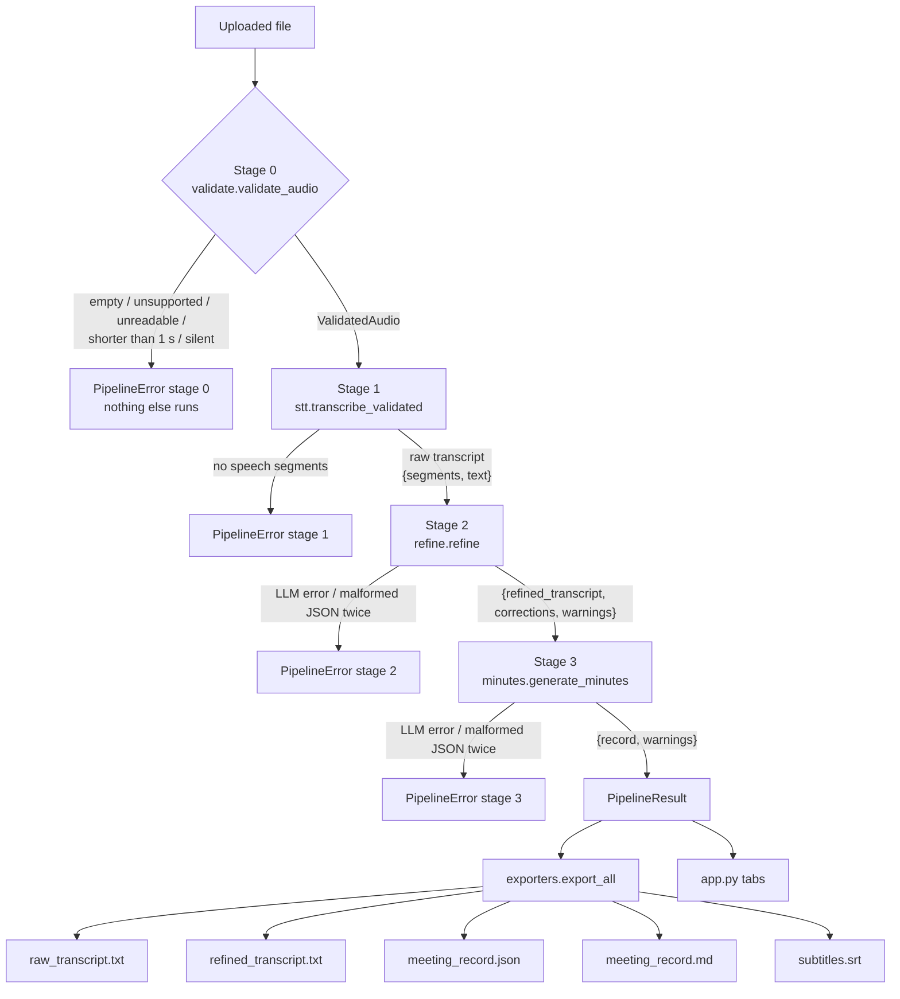

# Technical Overview

This document describes the models the meeting assistant uses, what each one is responsible for, and how data moves through the pipeline. Setup and usage are in [README.md](README.md).

## Models

| Stage | Model | Runs | Role |
|---|---|---|---|
| 0. Validation | none (signal checks in code) | locally | Reject files that cannot or should not be processed |
| 1. Speech-to-text | **Whisper `small`** via **faster-whisper** (CTranslate2), with **Silero VAD** | locally (CPU `int8` by default, GPU `float16` if available) | Audio → raw transcript with segment timestamps |
| 2. Refinement (LLM #1) | **Claude Sonnet 5.5** (`claude-sonnet-5-5`) | Anthropic API | Correct misheard technical terms, acronyms and names; nothing else |
| 3. Documentation (LLM #2) | **Claude Opus 5.5** (`claude-opus-5-5`) | Anthropic API | Summary, minutes, key decisions, action items, open questions |

All model names are configurable in `.env` (`WHISPER_MODEL_SIZE`, `REFINE_MODEL`, `MINUTES_MODEL`). The values above are the defaults.

### Whisper small (stage 1)

- **Model.** OpenAI's Whisper `small` (about 244M parameters), in the CTranslate2 conversion published as `Systran/faster-whisper-small`. It is downloaded from Hugging Face on first use (about 460 MB) and cached.
- **Settings.** It runs with `language="en"`, beam size 5 and `vad_filter=True`. The VAD is Silero VAD v6, bundled with faster-whisper, which skips stretches without speech. That avoids Whisper's tendency to invent text during silence, and saves time.
- **Why `small`.** It is the largest size that stays practical on a laptop CPU with `int8` quantisation. `medium` and `large-v3` are more accurate but several times slower on CPU, and stage 2 exists to fix the term errors a smaller model makes.
- **Measured speed.** On the CPU-only development laptop, with the model already downloaded and load time included:

  | Clip | Length | Time |
  |---|---|---|
  | `speech.wav` | 14.4 s | 8.0 s |
  | `normal.wav` | 25.5 s | 7.0 s |
  | `no_owner.wav` | 15.1 s | 5.7 s |
  | `proposal.wav` | 16.0 s | 8.6 s |

  Full-length meetings have not been timed yet.

### Claude Sonnet 5.5 (stage 2, refinement)

Refinement is a narrow, mostly mechanical edit: keep the text as it is, except fix words like "cube control" → "kubectl" or "PREA" → "Priya" (when "Priya" is in the user's vocabulary). It needs good knowledge of technical vocabulary and close instruction-following, but little deep reasoning. That fits Sonnet, which is faster and costs half as much per token as Opus. It runs at effort `medium`.

### Claude Opus 5.5 (stage 3, documentation)

The documentation stage makes the judgements that matter most to readers:
- whether something was **agreed** or only **proposed**;
- whether a task was actually **committed to**;
- whether an owner or deadline was **explicitly stated**.

These are the errors the problem statement forbids, so this stage uses the more capable model, at effort `high`. Using a different model from stage 2 also means the two stages don't share the same blind spots.

Both LLM stages request **structured JSON output** (`output_config.format` with a JSON schema). They also enable the API's **refusal fallback** (`fallbacks: "default"`), which retries a request on another model if a safety classifier declines it. Both models have a 1M-token context window, so a multi-hour meeting fits in a single documentation call.

## Data flow



`pipeline.run_pipeline(path, vocabulary, on_status)` runs the stages in this order. Each stage runs only if the one before it succeeded. Any failure raises `PipelineError(stage, reason)`, with a message such as `Stage 2 (refinement) failed: …`. Errors a stage doesn't anticipate are also caught and reported against that stage. The original exception is kept as `__cause__`.

### Stage 0: the validation gate

`validate.validate_audio(path)` runs first and is the only thing that touches the file before it is accepted. It imports only PyAV and numpy, so a bad file is rejected before faster-whisper is even imported. A test checks this.

| Check | How | Message |
|---|---|---|
| Missing or 0 bytes | file size | "The uploaded file is empty." |
| Unsupported extension | allowlist: wav, mp3, m4a, flac, ogg, aac | lists the supported formats |
| Not decodable | decode with PyAV (bundled FFmpeg); any decoder error or no audio stream | "The audio file is unreadable or corrupted…" |
| Too short | duration < 1.0 s | "The recording is too short (… s)…" |
| Silent | overall RMS < −60 dBFS, or < 2% of 30 ms frames above −45 dBFS | "No audio signal detected. The file appears to be silent." |

On success it returns `ValidatedAudio`. It contains the decoded samples, mono float32 at 16 kHz (the format Whisper expects), plus the duration and signal statistics. Stage 1 uses these samples directly, so the file is decoded only once.

One check can only run after Whisper: if it returns no segments with text, `validate.ensure_speech_detected` raises "No speech was detected in this recording." This is reported as a stage 1 failure.

### Stage 1 → 2: the raw transcript

```python
{"segments": [{"start": 0.0, "end": 2.12, "text": " Good morning everyone."}, ...],
 "text": " Good morning everyone. Let's start the review. ..."}
```

`text` is Whisper's segment texts joined with nothing in between. Each segment already starts with its own space, so this is Whisper's output exactly. Nothing is stripped or cleaned.

**The raw transcript is never modified after this point:**
- `run_pipeline` passes stage 2 a deep copy;
- `PipelineResult` keeps its own copy and returns fresh copies on access;
- the exporters only read it.

Tests cover each of these.

### Stage 2 → 3: the refined transcript

```python
{"refined_transcript": "Priya will update the kubectl config by Friday. ...",
 "corrections": [{"heard": "PREA", "corrected": "Priya"}, ...],
 "warnings": [...], "fallback_chunks": [...], "chunks": 1, "model": "claude-sonnet-5-5"}
```

`refine.refine(raw, vocabulary)` reads `raw["text"]` and sends it to the model in chunks:
- **Splitting:** the text is split at sentence ends into chunks of up to 6,000 characters. A very long stretch with no punctuation is split between words instead.
- **Prompt:** each chunk goes with `prompts/refine.txt` and the user's vocabulary.
- **Rejoining:** the refined chunks are rejoined in order.

**Checks on each chunk, in code.** A refined chunk is rejected, and the raw text kept for that part with a visible warning, if:
- its length is outside 70–140% of the raw chunk's length (unless the difference is under 25 characters);
- its numbers differ from the raw chunk's (ignoring thousands separators and numbers inside vocabulary terms);
- its count of negation words (not, no, never, -n't, …) differs from the raw chunk's.

A correction is only reported if its `heard` text is in the raw chunk and its `corrected` text is in the refined chunk.

### Stage 3 → output: the meeting record

```python
{"record": {"summary": "...",
            "minutes": [{"topic": "...", "points": ["..."]}],
            "key_decisions": [{"decision": "...", "evidence": "..."}],
            "action_items": [{"task": "...", "owner": "Priya" | "unspecified",
                              "deadline": "by Friday" | "unspecified", "evidence": "..."}],
            "open_questions": ["..."]},
 "warnings": [...], "model": "claude-opus-5-5"}
```

`minutes.generate_minutes(refined)` sends the refined transcript with `prompts/minutes.txt`. The prompt states the rules:
- only agreed items are decisions;
- only committed tasks are action items;
- owners and deadlines must be stated explicitly, otherwise `"unspecified"`;
- speakers are unknown, so "I" or "you" never identifies an owner;
- evidence is copied exactly from the transcript.

**Checks after the model replies, in code:**
- **Owners and deadlines:** if one doesn't appear in the transcript, it is replaced with `"unspecified"` and a warning is added. Matching ignores case and punctuation but must match whole words, and each name in "Rahul and Meena" is checked separately. Values like "TBD", "N/A" and "none" also become `"unspecified"`.
- **Evidence:** if it isn't found word for word in the transcript, a warning names the decision or task so a person can check it.

### Output

`PipelineResult` has `raw_text`, `segments`, `refined_transcript`, `corrections`, `record`, and `warnings` (from stage 2, then stage 3).

`exporters.export_all` builds **one** record object and renders both `meeting_record.json` and `meeting_record.md` from it, so their decisions and action items cannot differ. Tests parse the Markdown back and compare it field by field with the JSON.
- **Markdown:** characters that could be read as formatting are escaped, so the text renders exactly as in the JSON.
- **Subtitles:** `subtitles.srt` uses the raw segments and their exact timestamps (`HH:MM:SS,mmm`).

The app (`app.py`) only displays these values. All pipeline text is HTML-escaped and never rendered as Markdown.

## JSON reliability

Both LLM stages go through `llm.complete_json`:

1. **Request:** it asks for a reply matching the stage's JSON schema.
2. **Validation:** it parses the reply and runs the stage's own field checks.
3. **Retry:** if parsing or checks fail, including a reply cut off at the token limit, it retries **once**. The retry includes the failed reply and the error.
4. **Failure:** a second failure raises an error, and the pipeline reports it as that stage failing.

A refusal, a missing or invalid API key, an unknown model, rate limiting and network failures each produce a specific message instead of a traceback.

## Prompts

| File | Used by | Key instructions |
|---|---|---|
| `prompts/refine.txt` | stage 2 | Correct only plausible mishearings; prefer vocabulary spellings; keep names, numbers, negations, commitments, wording and order exactly; never summarise, add, remove or reorder; no speaker labels |
| `prompts/minutes.txt` | stage 3 | Proposals are not decisions; suggestions are not tasks; owner/deadline only if explicitly stated, else `"unspecified"`; speakers are unknown; evidence copied exactly |

Prompts are loaded from these files at run time. No prompt text lives in the Python code apart from the one-line retry message in `llm.py`.

## Testing

`python -m pytest` runs 115 tests. They use fake models, so they need no API key or model download. They cover:
- every validation case;
- that a bad file never loads Whisper;
- that Whisper's exact text is kept;
- refinement chunking and its fallback checks;
- JSON retry and failure handling;
- the owner, deadline and evidence checks;
- identical Markdown and JSON records;
- SRT formatting and timing;
- stage order and errors in the pipeline;
- the read-only result;
- the app's rendering and its error-only display.

## Known limitations

- **No speaker identification**, by design. "I'll send it" therefore has no known owner.
- **Thresholds are untuned:** the refinement length bounds and the silence limits have not yet been tested on real meeting recordings.
- **Chunk edges:** each refinement chunk is processed without its neighbours, so a term split across a chunk boundary may not be corrected.
- **Paraphrased evidence** is flagged but not removed. The code checks that an owner's name appears in the transcript, not that it was attached to the right task.
